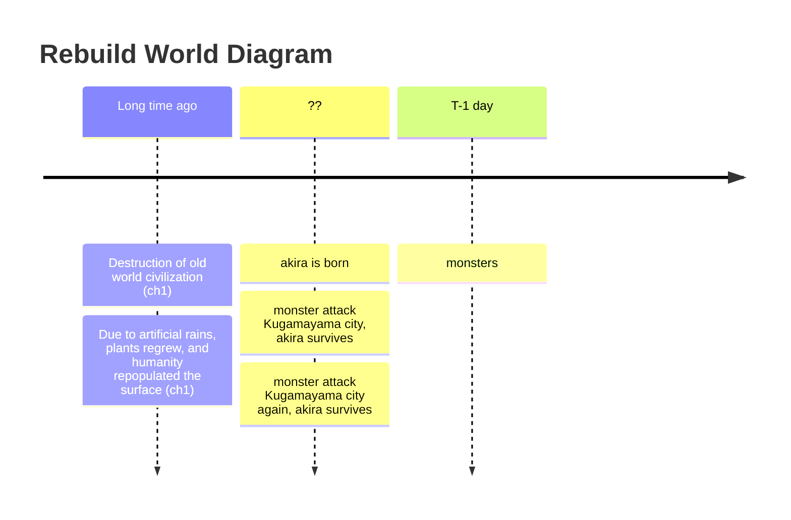

# Long time ago
- Destruction of old world civilization[^1]
- Due to artificial rains, plants regrew, and humanity repopulated the surface[^2]
# ??
- ?? - akira is born
- ?? - monster attack Kugamayama city, akira survives (ch.1)
- ?? - monster attack Kugamayama city another time, akira survives (ch.1)
- [T - 1 day] - monster attack Kugamayama city, akira survives, kills a monster, decides to become a hunter (ch.1)

- [x] - akira's searching for relics in kuzusuhara (ch.1)
- Akira encounters Alpha, establishes contact and escapes monsters (ch.1)

